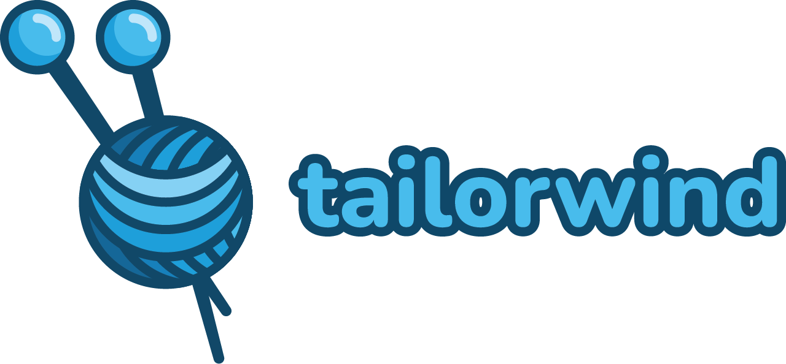

<p align="center">
  
  <p align="center">Make those divs tell a story.</p>
  <p align="center">
    
    
    
  </p>
</div>
<hr>

</br></br>

# What's this? 🧶
Tailorwind is a super tiny little library that allows you to easily declare components with the utility classnames from tailwind. Basically - you'll be able to pull stuff like this:

```
// Super basic
const ChiliButton = tw.button`bg-[red]`

// Spicy basic
const ChiliButton = tw('button')`bg-[red]`

// Whoa! Look at you go! 
const AnimatedChiliButton = tw(motion.button)`bg-[red]`

// You should really chillax.
const StyledComponent = styled.button`display: flex; justify-content: center;`
const ChiliButton = tw(StyledComponent)`bg-[red]`
```

## Why this? 🤔
I love tailwind. It's simply great. But - I was starting to get a little bit tiered of the whole "div-bonanza" consisting of `<div className="p-8 bg-red-500 ... bla bla" />` and so on. I know what you're thinking - just declare a component that accepts children and use that bad boi if you'd like more verbose components. Fine, that's one way to go about it. But think of all the **lines** we're saving 💙.

We're taking this chunky chunk-chunk:
```
const ChiliButton = (props: ButtonHTMLAttributes<HTMLButtonElement>) => {
  return (
    <button className="bg-[red]" {...props}>
      {children}
    </button>
  )
}
```
and replacing it with this slimmy slim-slim:
```
const ChiliButton = tw.button`bg-[red]`
```

It might be a 🌶️**HOT TAKE**🌶️ but I'd say it's *at least* a little bit of a win.

## With the power of tailorwind ⚡
You get the gist. You write smaller amounts of code and it makes it a bit easier to read. Here's my final example to trick you into using my simple little library.

```
const BaseButton = tw(motion.button)`p-8 rounded-2xl`

const variants: Variants = {
  initial: {
    scale: 0.2,
    opacity: 0,
  },
  animate: {
    scale: 1,
    opacity: 1,
  },
  tap: {
    scale: 0.8,
  },
  hover: {
    scale: 1.2,
  },
}

BaseButton.defaultProps = {
  initial: 'initial',
  animate: 'animate',
  whileTap: 'tap',
  whileHover: 'hover',
  variants,
}

const Button = {
  Primary: tw(BaseButton)`bg-[red]`,
  Secondary: tw(BaseButton)`bg-[green]`,
  Tertiary: tw(BaseButton)`bg-[blue]`,
}
```

Fully animated and ready to rumble - with the power of the all might framer-motion. Just slap one of those motion components right in there and watch that component purr. 🧶

## Hey oh! Missing feature alert 🚨
You might end up in a corner where you need a bit more functionallity. This teeny tiny lib is just supposed to do the absolute necessity to get the component declaration show on the road. If you're looking for a more [styled-components](https://styled-components.com/) type of wibe - I'd direct you right on over to: [tailwind-styled-components](https://github.com/MathiasGilson/tailwind-styled-component). That's also a teeny tiny library that's just a tad bit larger - but also does a tad bit more. 🍻 So check that out before wrecking havoc over here with your silly little feature requests. 💙


</br></br>

<p align="center"><br>
  The was built with love 🥰, black metal 🎸, and and just a bit of spare time. 💙</br></br>
  
</p>